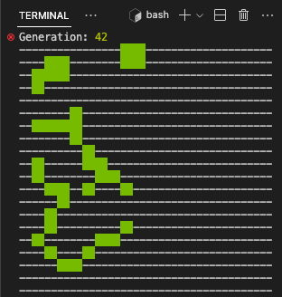

# game-of-life


<!--


-->

## 🚀 Projeto

Uma simulação do "jogo de zero jogadores" do "[Jogo da Vida](https://pt.wikipedia.org/wiki/Jogo_da_vida)" ([Conway's Game of Life](https://en.wikipedia.org/wiki/Conway%27s_Game_of_Life)) criado pelo matemático [John Horton Conway](https://en.wikipedia.org/wiki/John_Horton_Conway) em 1970.

<div align="center">
    
</div>

## 🛠️ Tecnologias
- [Node.js](https://nodejs.org/en/)
- [Javascript](https://developer.mozilla.org/pt-BR/docs/Web/JavaScript)

## 🗂️ Utilização

### 🐑🐑 Clonando o repositório:

```bash
  $ git clone url-do-projeto.git
```

### ▶️ Rodando o App:

```bash
  $ cd game-of-life                  # change to this directory
  $ node gameOfLife.js blinker.txt   # run the script
  $                                  # (import initial board from the "blinker.txt" file inside the "boards" folder)
```

## ⭐ Like, Subscribe, Follow
Curtiu o projeto? Marque esse repositório com uma Estrela ⭐!
